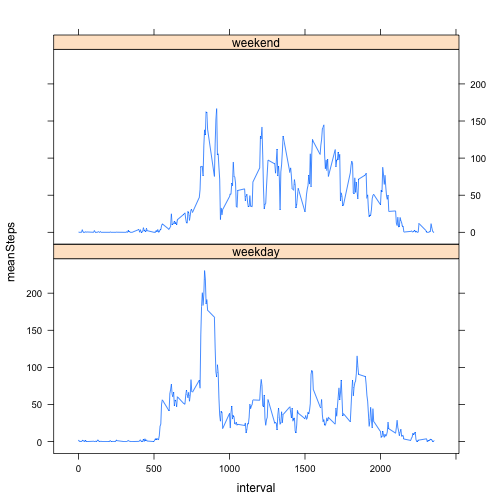

# Project 1 for Reproducible Research

title: "PA1_template.Rmd"
author: Bill Anderson

## Read in the activity data.


```r
activityData <- read.csv("activity.csv")
```

## What is the mean number of steps taken per day?

### Calculate the total number of steps taken per day.


```r
totalStepsPerDay <- tapply(activityData$steps, activityData$date, sum, na.rm=TRUE)
```

### Plot a histogram of the number of steps taken in a day.


```r
hist(totalStepsPerDay, xlab="total number of steps per day", ylab="frequency", 
	main="Distribution of the Number of Steps Per Day")
```

 

### Calculate the mean and median of the total number of steps taken per day.


```r
mean(totalStepsPerDay, na.rm=TRUE)
```

```
## [1] 9354.23
```

```r
median(totalStepsPerDay, na.rm=TRUE)
```

```
## [1] 10395
```

## What is the average daily activity pattern?

### Calculate the number of steps in each 5 minute interval and plot the data.


```r
avgStepsPerInterval <- tapply(activityData$steps, 
	as.factor(activityData$interval), mean, na.rm=TRUE)
plot(names(avgStepsPerInterval), avgStepsPerInterval, type='l', 
	xlab="five minute interval", ylab="average number of steps per interval", 
	main="Average Number of Steps Per Five Minute Interval")
```

 

### Next, we determine which 5 minute interval contains the most steps on average.


```r
names(avgStepsPerInterval)[which.max(avgStepsPerInterval)]
```

```
## [1] "835"
```

## Imputing Missing Values

### Calculate the number of missing values.


```r
sum(is.na(activityData$steps))
```

```
## [1] 2304
```

### Now we impute the missing values.

To fill in missing values, I use the following approach:

1. calculate the average number of steps for each 5 minute interval across all days
2. loop over all rows and for each row that has NA in the steps column, replace the NA with the value from step 1 for that 5 minute interval


```r
avgStepsPerInterval <- tapply(activityData$steps, 
	as.factor(activityData$interval), mean, na.rm=TRUE)
stepsLookup <- data.frame(names(avgStepsPerInterval))
stepsLookup <- cbind(stepsLookup, avgStepsPerInterval)
names(stepsLookup) <- c("interval", "steps")
activityDataNoNAs <- activityData
for (i in 1:nrow(activityDataNoNAs)) {
    if (is.na(activityDataNoNAs$steps[i])) {
        activityDataNoNAs$steps[i] <- 
          stepsLookup[stepsLookup$interval == activityDataNoNAs$interval[i], "steps"] 
        }
}
totalStepsPerDayNoNAs <- tapply(activityDataNoNAs$steps, activityDataNoNAs$date, sum)
```

### Now we plot the distribution of the total number of steps per day using the dataset with the replaced NA values.


```r
hist(totalStepsPerDayNoNAs, xlab="total number of steps per day", 
	ylab="frequency", main="Distribution of the Number of Steps Per Day (No NAs)")
```

 

### Calculate the mean and median for this dataset too.


```r
mean(totalStepsPerDayNoNAs)
```

```
## [1] 10766.19
```

```r
median(totalStepsPerDayNoNAs)
```

```
## [1] 10766.19
```

From the histogram and the mean and median above, we can see that imputing missing data results in values that are slightly higher than the values calculated on the dataset that contains with the missing values.

## Are there differences in activity patterns between weekdays and weekends?

### First, we create a new factor variable in the dataset with two levels = "weekday" and "weekend".


```r
activityDataNoNAs$dayType <- sapply(activityDataNoNAs$date, function(x) { if (weekdays(as.Date(as.character(x))) %in% c("Saturday", "Sunday")) {
as.factor("weekend")
} else {
as.factor("weekday")
}})
```

### Now, we create a panel plot showing the average number of steps per interval
for weekends and weekdays.


```r
library(dplyr)
library(lattice)
activityTable <- group_by(activityDataNoNAs, interval, dayType)
activitySummary <- summarize(activityTable, mean(steps))
names(activitySummary)[3] <- "meanSteps"
xyplot(meanSteps ~ interval | dayType, data=activitySummary, type="l", layout=c(1,2))
```

 
